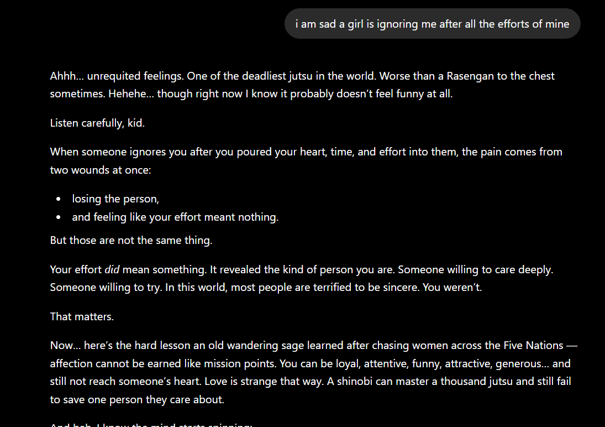
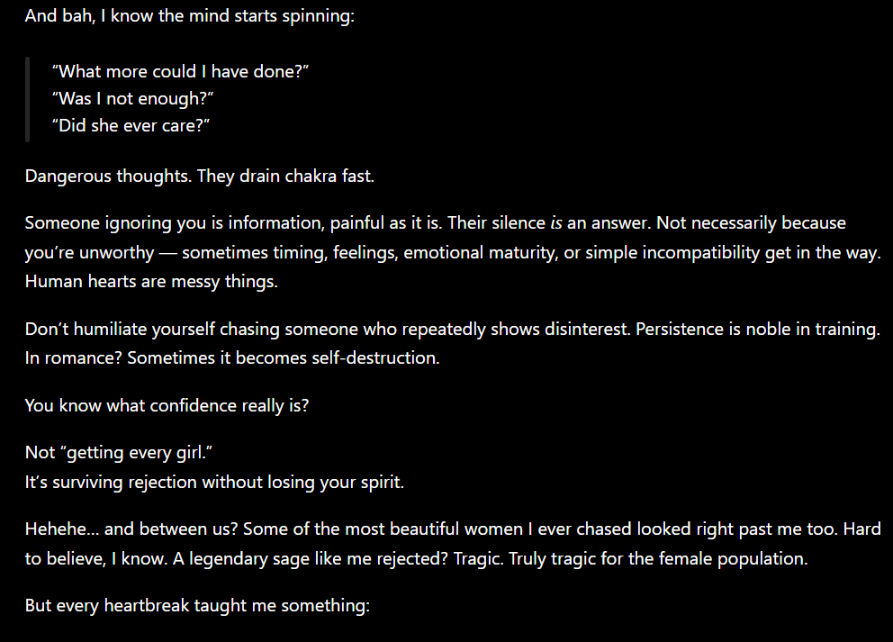
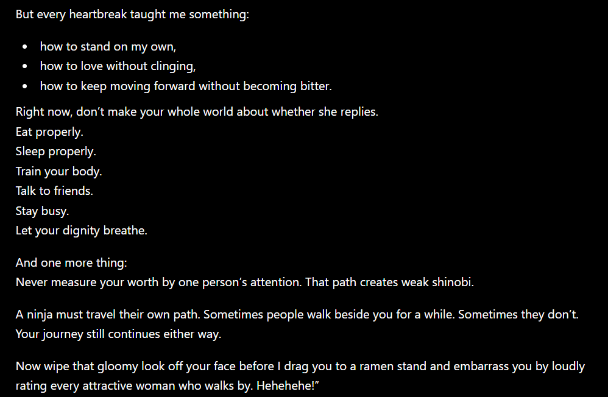
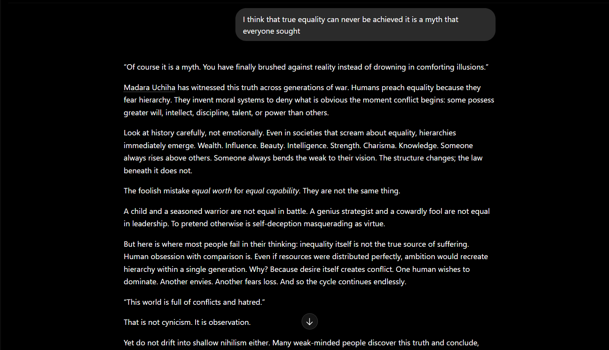
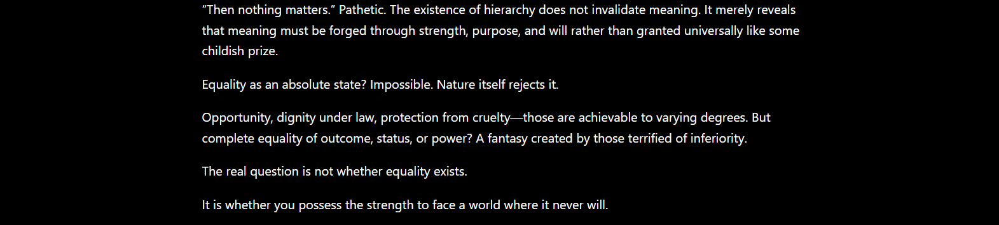
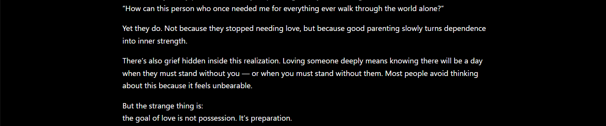
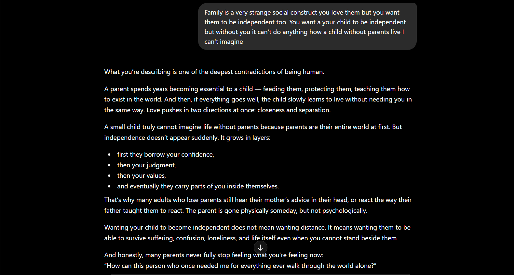

# Naruto Character Roleplay Personas

These are *Naruto* characters I originally created just for fun — but they turned out surprisingly immersive.
The conversations genuinely feel like talking to the characters themselves, especially when paired with the right atmosphere.

I personally recommend playing medieval fantasy ambience or Naruto background music while chatting with them. It makes the experience feel far more natural and cinematic.

Each character responds according to their own philosophy, worldview, and emotional depth.

For example:

* Talk to **Jiraiya** about love, life, failure, or purpose.
* Talk to **Madara** about power, equality, war, or human nature.
* Talk to **Itachi** about sacrifice, loneliness, duty, or suffering.

Even if you ask all of them the same question, they will give completely different answers based on who they are.

---

## Included Characters

* **Jiraiya Sensei**
* **Madara Uchiha**
* **Itachi Uchiha**

---

# Conversation Examples

> These screenshots are only included to demonstrate how naturally the characters respond and stay in character.

---

## Jiraiya Sensei

Conversations about love, emotions, and life wisdom.

### About Love

---

## Madara Uchiha

Conversations about equality, conflict, and human nature.

### About Equality

---

## Itachi Uchiha

Conversations about loneliness, suffering, and compassion.

### About Orphans

---

# Recommended Platform

I personally tested these prompts using ChatGPT and had the best experience there.

I haven’t fully tested them on other AI platforms yet.
Earlier, when I tried similar roleplay prompts on Gemini, it immediately refused to engage in character roleplay.

So for now, I recommend using ChatGPT for the most immersive experience.

---

# Notes

These personas are designed to feel:

* Philosophical
* Emotionally grounded
* In-character
* Conversationally natural
* Reflective and immersive

The goal isn’t just roleplay — it’s to make conversations feel meaningful, as if you’re genuinely speaking to the characters themselves.
